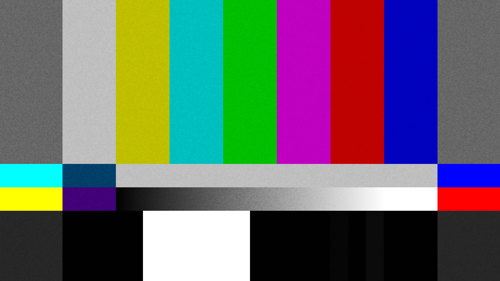

# perfectgrain

Add noise grain to images.

Limitations: The images should not be bigger than the filter.

  
   
  <i>Input example</i>

  
   
  <i>Output example with opacity at 170</i>

# How to use

- Install Python
- Place the images to the `in` folder
- Execute the script `run.ps1` or run `python ./pipe_filters.py in out 'filters/Ilford HP5.jpg' 170`
- The images should appear in the `out` folder

# Configuration

Change the python command to pass different folders, filter or opacity.

`python pipe_filters.py in out filter opacity`

- in: input folder path
- out: output folder path
- filter: filter image path
- opacity: int between 0 and 255, where 0 is transparent

# Credits

Film grain by [filmcomposite](https://www.filmcomposite.com/free-stuff/free-35mm-film-grain-stills).
